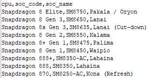
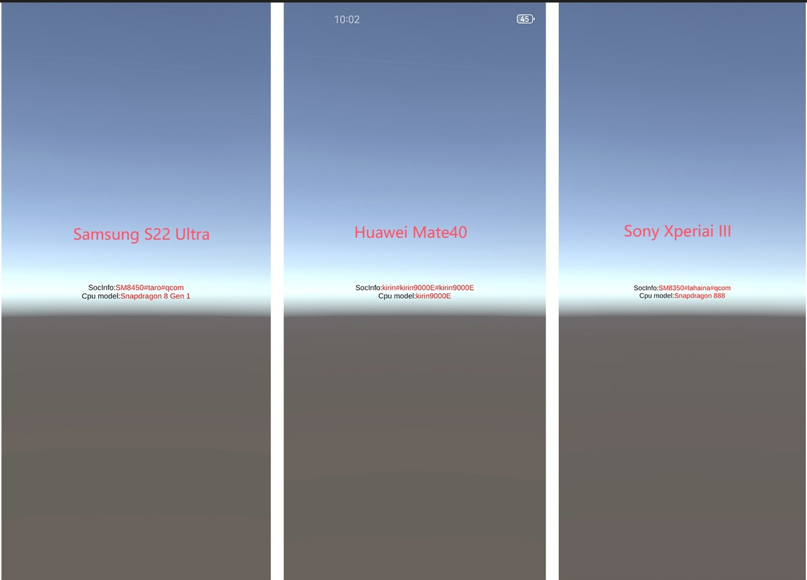

本文提出了一种在unity中基于SOC信息配合SOC映射表，精准获取移动设备CPU信号的方法，有效解决了在unity游戏开发过程中难以获取CPU信号的问题。
## 一、问题背景
在unity游戏性能优化过程中，尤其是移动端游戏，获取准确的硬件设备信息对于游戏性能分档至关重要，尤其是精准获取设备的CPU型号。这种情况在Android设备中尤为严重，由于长期的碎片化发展，导致开发者根本无法通过单一的方法有效准确地获取CPU型号，笔者查阅了很多资料均无法提供比较有效的办法，因而需要另辟蹊径。
## 二、解决方案
通过测试发现通过大部分常规方法，比如通过Android底层的”**Build.HARDWARE**“提取，有时能返回准确CPU型号，有时返回一串设备内部代码（有些时候是CPU厂商SOC编码），有时什么也没有。查阅Android API发现Google在API Level31后加入[SOC_MODEL](https://developer.android.com/reference/android/os/Build#SOC_MODEL)，要求在该API Level之上的设备必须提供相应的SOC编码。而这个SOC编码就和精确的CPU型号是一一对应的，因此我们只需要建立SOC编码和CPU的映射关系，通过组合各种办法尽可能的获取SOC编码，便可查询到精确的CPU型号，比如**SM8650**对应于**Snapdragon 8 Gen 3**，**SM8350**对应于**Snapdragon 888**。

## 三、核心代码
为了尽可能兼容更老的Android设备，因此这里不采用直接读取"**Build.SOC_MODEL**"，而是采用兼容性更好的方法“**getprop xx.xx.xx**"来获取设备信息，代码如下：
```java
import android.os.Build;  
import java.io.BufferedReader;  
import java.io.InputStreamReader;    
public class SocUtils {  
    public static String getSocInfo(){  
        String socModel=getSocModel();  
        String socPlatform=getSocPlatform();  
        String socHardware=getSocHardware();  
        return socModel+"#"+socPlatform+"#"+socHardware;  
    }    public static String getSocModel() {  
        String soc = getSystemProperty("ro.soc.model");  
        return soc;  
    }  
    public static String getSocPlatform(){  
        String platform = getSystemProperty("ro.board.platform");  
        return platform;  
    }  
    public static String getSocHardware(){  
        String hardware = getSystemProperty("ro.hardware");  
        if (hardware != null && !hardware.isEmpty())  
            return hardware;  
        return Build.HARDWARE;  
    }  
    private static String getSystemProperty(String key) {  
        try {  
            Process process = Runtime.getRuntime().exec("getprop " + key);  
            BufferedReader reader = new BufferedReader(new InputStreamReader(process.getInputStream()));  
            String line = reader.readLine();  
            reader.close();  
            return line != null ? line.trim() : "";  
        } catch (Exception e) {  
            return "";  
        }    }}
```

对应的C#端代码如下：
```C#
using UnityEngine;
public class SoCUtils
{
    private const string JavaClassName = "SocUtils";
    public static string GetSocFullInfo()
    {
#if UNITY_ANDROID&& !UNITY_EDITOR
        try
        {
            using (var socUtils = new AndroidJavaClass(JavaClassName))
            {
                //返回信息：socmodel#platform#hardware
                return socUtils.CallStatic<string>("getSocInfo");
            }
        }
        catch (System.Exception e)
        {
            Debug.LogError(e);
            return GetDefault();
        }
#else
        return GetDefault();
#endif
    }
    private static string GetDefault()
    {
        var type = SystemInfo.processorType;
        return $"{type}#{type}#{type}";
    }
}
```

最后通过获取的socinfo，比对预先建立好的soc_cpu映射表，便能精准获取到对应的cpu型号，映射关系核心代码如下：
```C#
using System.Collections.Generic;
using UnityEngine;
[CreateAssetMenu(menuName = "New socasset", fileName = "socasset.asset")]
public class Soc_cpuMap : ScriptableObject, ISerializationCallbackReceiver
{
    public List<string> soc_list = new();
    private Dictionary<string, string> soc_code2cpu = new();
    private Dictionary<string, string> soc_name2cpu = new();
    public void OnBeforeSerialize() { }
    public void OnAfterDeserialize()
    {
        soc_code2cpu.Clear();
        soc_name2cpu.Clear();
        foreach (var soc in soc_list)
        {
            var parts = soc.Split(',');
            var cpu = parts[0];
            var soc_code = parts[1];
            var soc_name = parts[2];
            soc_code2cpu.TryAdd(soc_code, cpu);
            if (!string.IsNullOrEmpty(soc_name))
            {
                soc_name2cpu.TryAdd(soc_name, cpu);
            }
        }
    }
    /// <summary>
    /// Get the real cpu model from socinfo
    /// </summary>
    /// <param name="socinfo"></param>
    /// <returns></returns>
    public string GetRealCPUModel(string socinfo)
    {
        var infos = socinfo.Split('#');
        var actualCpu = ""; 
        Debug.LogError(actualCpu);
        foreach (var info in infos)
        {
            if (soc_code2cpu.TryGetValue(info, out actualCpu) || soc_name2cpu.TryGetValue(info, out actualCpu))
                return actualCpu;
        }
        return infos[2];//默认为hardware
    }
}
```

## 四、测试结果
通过随机测试了一批手机，均能精准获取到对应的CPU型号，部分设备的获取信息如下：

示例工程如下：[DeviceInfoDetector](https://github.com/xinjay/DeviceInfoDetector)